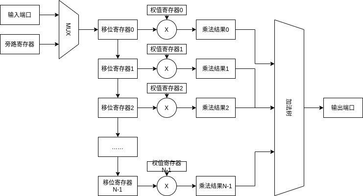

# parameter

| 名称   | 说明               | 默认值 |
| ------ | ------------------ | ------ |
| DWIDTH | 输入数据位宽       | 8      |
| AWIDTH | 数据窗口地址宽度   | 6      |
| WINLEN | 数据窗口长度       | 64     |
| OWIDTH | 输出数据位宽       | 22     |
| OSTART | 开始截取输出的位数 | 0      |

 
# port

| 名称      | 类型  | 位宽   | 说明                 |
| --------- | ----- | ------ | -------------------- |
| clk       | input | 1      | 系统时钟             |
| rst_n     | input | 1      | 系统复位信号，低有效 |

## 配置端口

| 名称      | 类型       | 位宽   | 说明             |
| --------- | ---------- | ------ | ---------------- |
| cfg_valid | input      | 1      | 配置数据有效信号 |
| cfg_busy  | output reg | 1      | 配置信息忙  |
| cfg_addr  | input      | AWIDTH | 配置数地址信息   |
| cfg_data  | input      | DWIDTH | 配置数据         |

## 输入端口

| 名称          | 类型       | 位宽   | 说明             |
| ------------- | ---------- | ------ | ---------------- |
| fir_din_valid | input      | 1      | 输入数据有效信号 |
| fir_din_busy  | output reg | 1      | 输入数据忙信号 |
| fir_din_data  | input      | DWIDTH | 输入数据         |

## 输出端口

| 名称           | 类型       | 位宽   | 说明             |
| -------------- | ---------- | ------ | ---------------- |
| fir_dout_valid | output | 1      | 输出数据有效信号 |
| fir_dout_busy  | input      | 1      | 输出数据忙信号   |
| fir_dout_data  | output     | OWIDTH | 输出数据         |

# 详细设计

使用流水线实现整个设计分为：
- 输入
- 移位寄存器
- 乘法结果
- 加法结果（流水线加法树）

流水线的控制接口为`fir_dout_busy`，当该信号拉高时，流水线停止工作。但是输入接口此时还会输入一个数据，暂时保存在旁路寄存器中。

旁路部分为流控设计，输入端口阻塞（输出阻塞输入有效）时，数据存储旁路寄存器

当输入端口阻塞时，旁路寄存器有效信号拉高，当完成一次输出时，旁路寄存有效信号拉低

对于输入而言，若旁路寄存器有效，则输入旁路寄存器中的数据，否则输入输入端口的数据

对于加法树而言，使用二叉树写法，即第i个加法器的输入为第$i \times 2 + 1$个加法器和第$i \times 2 + 2$个加法器。