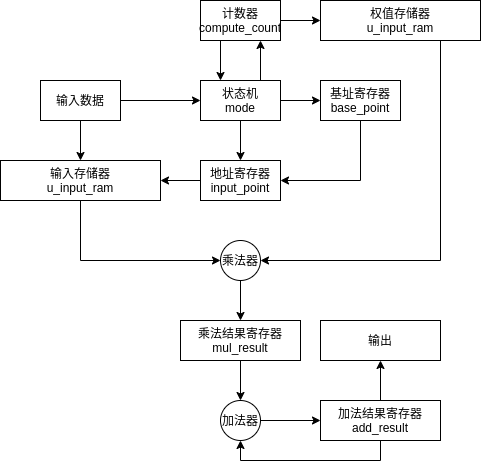

# parameter

| 名称   | 说明               | 默认值 |
| ------ | ------------------ | ------ |
| DWIDTH | 输入数据位宽       | 8      |
| AWIDTH | 数据窗口地址宽度   | 6      |
| WINLEN | 数据窗口长度       | 64     |
| OWIDTH | 输出数据位宽       | 22     |
| OSTART | 开始截取输出的位数 | 0       |
 
# port

| 名称      | 类型  | 位宽   | 说明                 |
| --------- | ----- | ------ | -------------------- |
| clk       | input | 1      | 系统时钟             |
| rst_n     | input | 1      | 系统复位信号，低有效 |

## 配置端口

| 名称      | 类型  | 位宽     | 说明             |
| --------- | ----- | -------- | ---------------- |
| cfg_valid | input | 1        | 配置数据有效信号 |
| cfg_addr  | input | AWIDTH | 配置数地址信息   |
| cfg_data  | input | DWIDTH   | 配置数据         |

## 输入端口

| 名称          | 类型       | 位宽   | 说明             |
| ------------- | ---------- | ------ | ---------------- |
| fir_din_valid | input      | 1      | 输入数据有效信号 |
| fir_din_busy  | output reg | 1      | 输入数据忙信号 |
| fir_din_data  | input      | DWIDTH | 输入数据         |

## 输出端口

| 名称           | 类型       | 位宽   | 说明             |
| -------------- | ---------- | ------ | ---------------- |
| fir_dout_valid | output reg | 1      | 输出数据有效信号 |
| fir_dout_busy  | input      | 1      | 输出数据忙信号   |
| fir_dout_data  | output     | OWIDTH | 输出数据         |

# link

| inst name    | module name      |
| ------------ | ---------------- |
| u_input_ram  | single_port_sram |
| u_weight_ram | single_port_sram                 |

> this is generate by linker
- u_weight_ram.rst_n <> serial_fir_ram.rst_n
- u_input_ram.rst_n <> serial_fir_ram.rst_n
- u_input_ram.clk <> serial_fir_ram.clk
- u_weight_ram.clk <> serial_fir_ram.clk

# 详细设计

状态机分为四个周期：
- 初始化：等待开始
- 输入：输入数据存入存储器
- 计算：计算当前结果
- 输出：将数据输出

当有输入数据时，由初始化跳转到输入，一个周期后跳转到计算，遍历完所有数据后跳转到输出，输出完成后跳转到初始化

compute_count在计算状态+1

base_point在输出到初始化的跳转中+1

地址寄存器在计算状态中每周期+1，在其他状态为base_point值

在计算状态下，乘法有效寄存器为1，其他状态为0（寄存器型），加法有效寄存器为乘法有效寄存器的打拍，当乘法有效寄存器为0，加法为1，表示最后一个数据送入，下一周期输出有效。