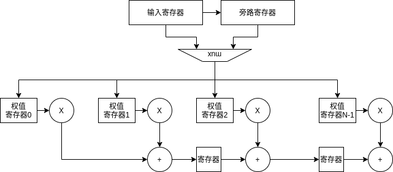

# parameter

| 名称   | 说明               | 默认值 |
| ------ | ------------------ | ------ |
| DWIDTH | 输入数据位宽       | 8      |
| AWIDTH | 数据窗口地址宽度   | 6      |
| WINLEN | 数据窗口长度       | 64     |
| OWIDTH | 输出数据位宽       | 22     |
| OSTART | 开始截取输出的位数 | 0      |

 
# port

| 名称      | 类型  | 位宽   | 说明                 |
| --------- | ----- | ------ | -------------------- |
| clk       | input | 1      | 系统时钟             |
| rst_n     | input | 1      | 系统复位信号，低有效 |

## 配置端口

| 名称      | 类型       | 位宽   | 说明             |
| --------- | ---------- | ------ | ---------------- |
| cfg_valid | input      | 1      | 配置数据有效信号 |
| cfg_busy  | output reg | 1      | 配置信息忙       |
| cfg_addr  | input      | AWIDTH | 配置数地址信息   |
| cfg_data  | input      | DWIDTH | 配置数据         |

## 输入端口

| 名称          | 类型       | 位宽   | 说明             |
| ------------- | ---------- | ------ | ---------------- |
| fir_din_valid | input      | 1      | 输入数据有效信号 |
| fir_din_busy  | output reg | 1      | 输入数据忙信号 |
| fir_din_data  | input      | DWIDTH | 输入数据         |

## 输出端口

| 名称           | 类型       | 位宽   | 说明             |
| -------------- | ---------- | ------ | ---------------- |
| fir_dout_valid | output | 1      | 输出数据有效信号 |
| fir_dout_busy  | input      | 1      | 输出数据忙信号   |
| fir_dout_data  | output     | OWIDTH | 输出数据         |

# 详细设计

使用流水线实现整个设计分为：
- 输入数据广播乘法
- 部分和移位相加
  
在输入数据端口进行流控措施，当输出端口阻塞时，阻止数据输入。将临界数据输入旁路寄存器中

流水线每个部分均以输出端口阻塞信号`is_dout_block`作为流水线的阻塞信号

为了保证加法位数不损失，每一级加法都扩展位宽，最终取出的数字根据parameter进行选取